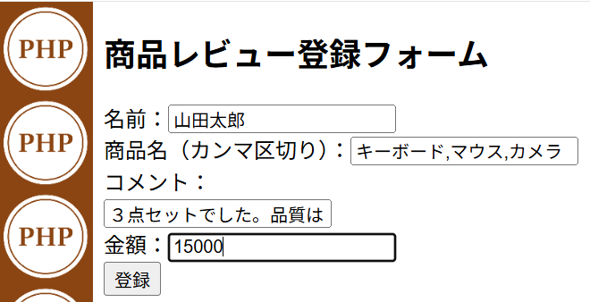

# 他によく使う関数

## mb_strlen 関数

### 🔹 解説

日本語などのマルチバイト文字の文字数を取得する

### 🔹 サンプルコード

ファイル名 : chap5_1.php

```php
<?php
$word = "こんにちは";
echo mb_strlen($word);
?>
```

### 🔹 出力結果


## trim 関数

### 🔹 解説

文字列の前後の空白を削除する

### 🔹 サンプルコード

ファイル名 : chap5_2.php

```php
<?php
$input = "  sample  ";
$clean = trim($input);
echo $clean;
?>
```

### 🔹 出力結果


## explode 関数

### 🔹 解説

区切り文字を基準に文字列を分割して配列にします。

### 🔹 サンプルコード

ファイル名 : chap5_3.php

```php
<?php
$str = "りんご,バナナ,みかん";
$fruits = explode(",", $str);
print_r($fruits);
?>
```

### 🔹 出力結果


## implode 関数

### 🔹 解説
配列を文字列に連結します。  
区切り文字の指定が可能。

### 🔹 サンプルコード

ファイル名 : chap5_4.php

```php
<?php
$items = ["パン", "牛乳", "卵"];
echo implode("・", $items);
?>
```

### 🔹 出力結果


## htmlspecialchars 関数

### 🔹 解説

HTMLタグの無効化・無害化をしてくれる

### 🔹 サンプルコード

ファイル名 : chap5_5.php

```php
<?php
$text = "<script>alert('警告！！');</script>";
echo htmlspecialchars($text);
?>
```

### 🔹 出力結果


## number_format 関数

### 🔹 解説
数値にカンマを付ける  
金額などを人が読みやすくするようにカンマ区切りにしてくれる

### 🔹 サンプルコード

ファイル名 : chap5_6.php

```php
<?php
$price = 1234567;
echo number_format($price);
?>
```

### 🔹 出力結果


## count 関数

### 🔹 解説

配列に何個要素があるかを調べるための関数

### 🔹 サンプルコード

ファイル名 : chap5_7.php

```php
<?php
$colors = ["赤", "青", "緑"];
echo count($colors);
?>
```

### 🔹 出力結果


## ファイル書き込み (fopen/fwrite/fclose) 関数

### 🔹 解説

ファイルに文字列を書き込んで保存する

### 🔹 サンプルコード

ファイル名 : chap5_8.php

```php
<?php
// 書き込むHTML文字列
$text = <<< HTML
<!DOCTYPE html>
<html lang="ja">
<head>
  <meta charset="UTF-8">
  <title>サンプル</title>
</head>
<body>
  これはfwriteで書き込んだサンプルテキストです。
</body>
</html>
HTML;

// ファイルを「書き込みモード」で開く（存在しない場合は新規作成）
$fp = fopen("sample.html", "w");

// ファイルが正しく開けたか確認
if ($fp) {
    // 文字列を書き込む
    fwrite($fp, $text);

    // ファイルを閉じる
    fclose($fp);

    echo "ファイルへの書き込みが完了しました。";
} else {
    echo "ファイルを開くことができませんでした。";
}
?>
```

### 🔹 出力結果


## ファイル読み込み (fopen/fread/filesize/fclose) 関数

### 🔹 解説

ファイルから文字列を読み込む

### 🔹 サンプルコード

ファイル名 : chap5_9.php

```php
<?php
$filename = "sample.html";

// ファイルを読み込み専用で開く
$fp = fopen($filename, "r");

if ($fp) {
    // ファイルサイズを取得して、全体を読み込む
    $filesize = filesize($filename);
    $content = fread($fp, $filesize);

    // ファイルを閉じる
    fclose($fp);

    // 読み込んだ内容を画面に表示（HTMLをエスケープせずそのまま表示）
    echo "<h3>sample.html の内容</h3>";
    echo "<hr>";
    echo "<pre>";
    echo htmlspecialchars($content);
    echo "</pre>";
} else {
    echo "ファイルを開くことができませんでした。";
}
?>
```

### 🔹 出力結果


---

# 演習問題

## 内容

あなたは簡易レビュー投稿システムを作ろうとしています。  
ユーザーは「名前」・「商品名」・「コメント」・「金額」を入力します。  
それをCSVファイルとして保存します。  
保存されたデータは画面に一覧表示させます。

以下の要件を満たすようにPHPでアプリを作成しなさい。

## 要件

🔸 入力フォーム : review_input.php
- 名前（テキスト入力）
- 商品名（カンマ区切りで複数指定可能）
- コメント（テキスト入力）
- 金額（数字のみ）

🔸 データの保存 : review_output.php
- 入力値の前後の空白は trim関数 を使って取り除くこと。
- 商品名は explode関数 で配列化し、implode関数 で「・」区切りの文字列に整形して保存すること。
- ファイルは "reviews.csv" とし、1行に「名前,商品リスト,コメント,金額」を書き込むこと。
- 書き込みには fopen関数 / fwrite関数 / fclose関数 を使用すること。

🔸 データの表示 : review_output.php
- fopen関数 / fread関数 / fclose関数 / filesize関数 を使ってファイルを読み込み、各行を explode関数 で分割して処理すること。

- 各レビューには次の情報を表示すること：

    - 名前（htmlspecialchars関数 で無害化）
    - 商品リスト（整形済の文字列）
    - コメント（文字数は mb_strlen関数 でカウントし、htmlspecialchars関数 で無害化）
    - 金額（number_format関数 を使ってカンマ区切り表示）
    - レビュー件数は count関数 を使って表示すること。

## 🔹 出力結果




### CSVファイル(reviews.csv)の中身


